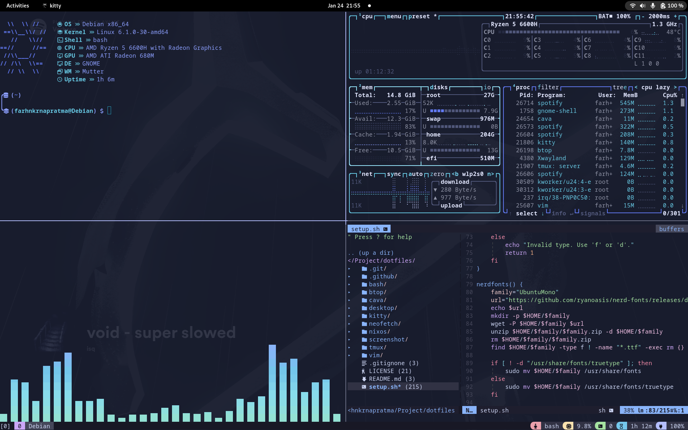

# My dotfiles


> Contact: farhnkrnapratma@gmail.com

## Setup

To setup all configuration files automatically, you can run the commands below:

```Bash
$ chmod +x setup.sh
$ ./setup.sh
```
If an error occurs, try:

```Bash
$ bash setup.sh
```

## Screenshots

### Debian GNOME with Kitty




### NixOS KDE Plasma with Kitty


---

&copy; 2025 Farhan Kurnia Pratama
