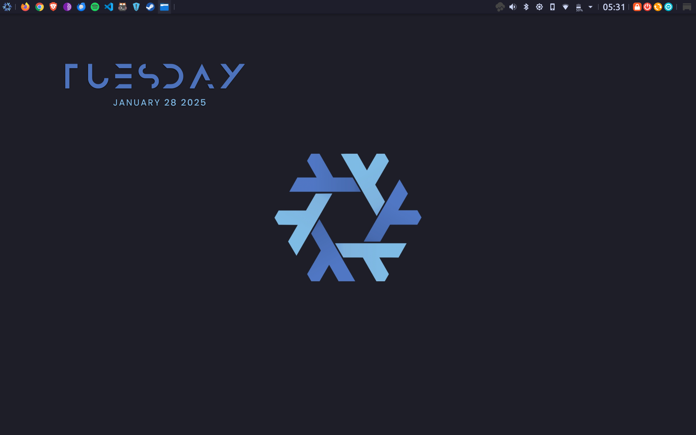
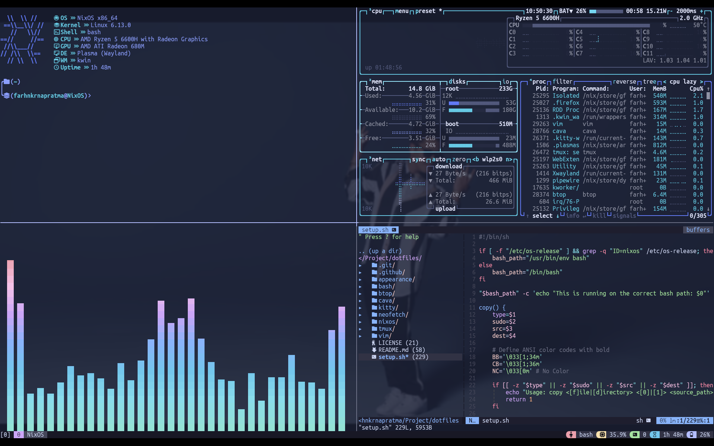

# Linux Desktop Appearance and Configs


> Contact: [`farhnkrnapratma@gmail.com`](farhnkrnapratma@gmail.com)

---

## Shell Setup

To setup all configuration files automatically, you can run the commands below:

```Bash
$ chmod +x setup.sh
$ ./setup.sh
```

---

## Wallpaper


> Want more distro wallpapers? Please contact me through the contact [`here`](https://gravatar.com/farhnkrnapratma).

---

## Screenshot





---

&copy; 2025 Farhan Kurnia Pratama
