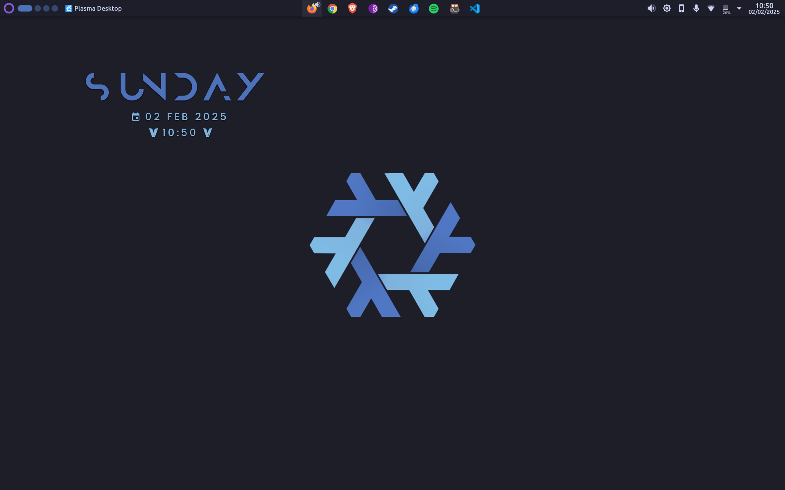

# My dotfiles


> Contact: farhnkrnapratma@gmail.com

## Setup - Bash

To setup all configuration files automatically, you can run the commands below:

```Bash
$ chmod +x setup.sh
$ ./setup.sh
```
If an error occurs, try:

```Bash
$ bash setup.sh
```

## Wallpaper

### NixOS


### Debian


### Tux


> Want more distro wallpapers? Please contact me through the contact [`here`](https://gravatar.com/farhnkrnapratma).

## Screenshot

### Debian - GNOME


### Debian - Kitty


### NixOS - KDE Plasma



### NixOS - Kitty


---

&copy; 2025 Farhan Kurnia Pratama
